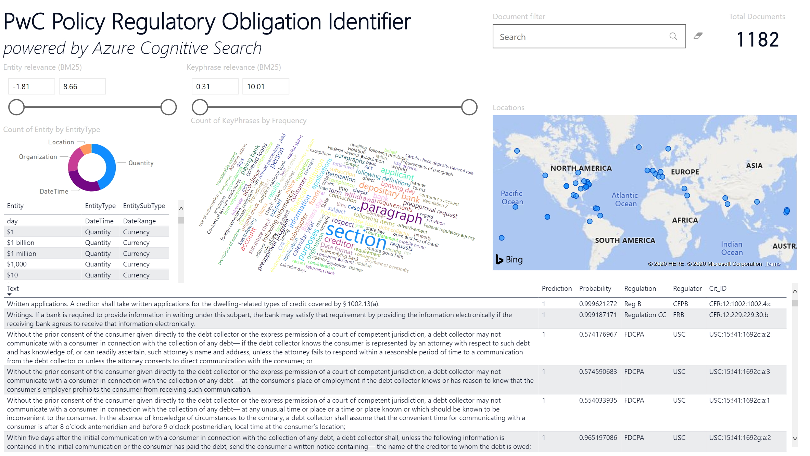
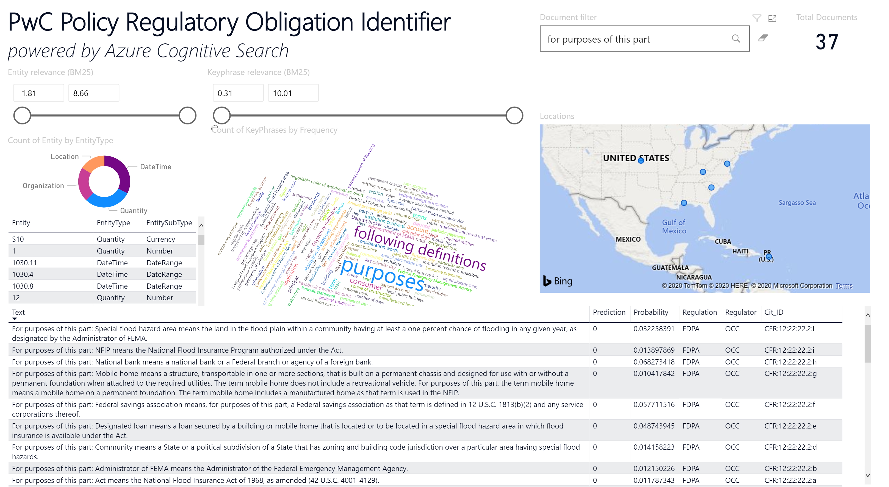
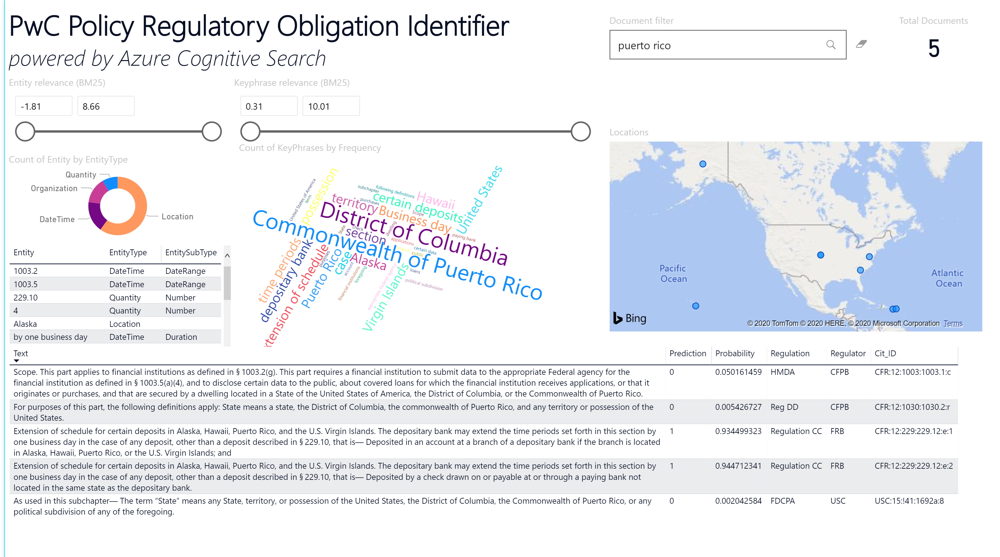
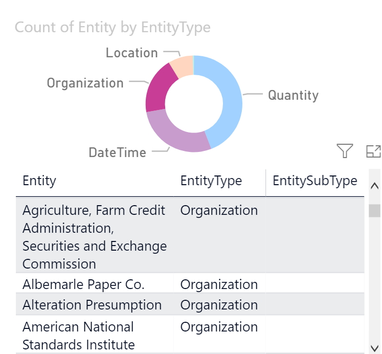
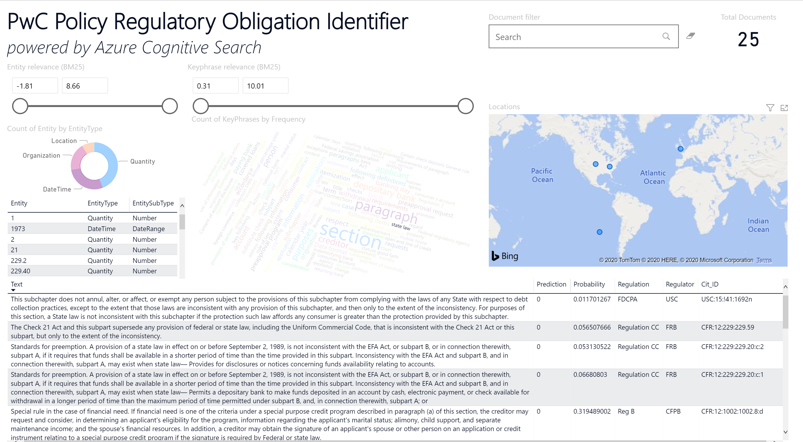
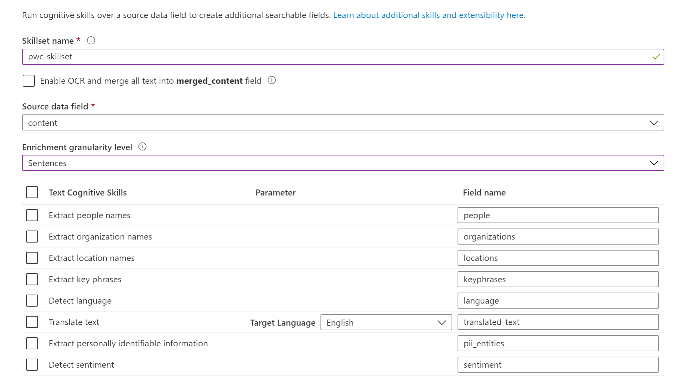

# PwC Regulatory Model with Cognitive Search Demo Script

All Cognitive Search instances can output AI-enriched data to a [knowledge store](https://docs.microsoft.com/azure/search/knowledge-store-concept-intro).  There is a [great PowerBI template](https://aka.ms/cogsearchpbi) that you can download which shows many common use cases, if you project your data to a knowledge store in Azure table storage.  

In this instance, we have modified this PowerBI template to show some of the functionality of the PwC model, and published it to <https://aka.ms/PwCCognitiveSearchDemo>.  

## Problem Background

Regulatory documents are hard to read, can change frequently, and there are penalties for businesses who don't comply with regulations.  For global companies who need to comply with regulations from governments all over the world, keeping up can be a challenge.  

For more information, see the customer story and video at <https://aka.ms/PwCCognitiveSearchStory>.  When demoing this solution, you are welcome to play the video and use the [PwC summary slide](https://ms-f7-sites-01-cdn.azureedge.net/docs/stories/811347-pwc-partner-professional-services-azure/resources/485ce088-70b2-440b-932d-9c9d11c4871d/pwc_summary_slide.pptx).  

## Demo Script

This demo shows the end results of the Cognitive Search pipeline that can be reconstructed from the code at <https://aka.ms/PwCCognitiveSearchCode>.  Cognitive Search's data ingestion pulls the pre-chunked data from Azure blob storage and applies a skillset with entity recognition, key phrase extraction, a custom skill for calling the PwC model, and shapers to format the data for the knowledge stores.  The resulting enriched data is indexed in Cognitive Search as well as projected to an Azure table storage knowledge store.  This demo is a Power BI interface over the Azure table storage knowledge store.  

+ **Navigate to <https://aka.ms/PwCCognitiveSearchDemo>.**  You will see:
  + Two sliders to adjust the relevance numbers  
  + A donut chart which shows the different entities that were found in the documents (locations, organizations, datetimes, quantities, etc.), along with a list of the entities below it
  + A word cloud that shows the key phrases found in the documents, where larger words occur more frequently
  + A map which plots the various locations (from the location entities that were extracted from the documents)
  + In the upper right-hand corner, there is a document filter that you can use to search the data, and the total number of documents that were processed.  As you filter using any of the charts, the total number of documents may change.  The total number of documents in the sample data is 1182.  
  + The table along the bottom shows the results of the PwC classification model.  The input to the model is the text chunks displayed in the first column, and the "Prediction" column gives the result from their model (0 means "not actionable" and 1 means "actionable") with the probability given in the "Probability" column.  The remaining columns are metadata about the regulatory document the text came from: the specific regulation, the regulator, and the section of the document/citation ID.  

+ **Search for "for purposes of this part" in the Document filter.**  Many regulatory documents contain legal definitions.  While these are important for understanding the document, definitions are not typically very actionable.  In the bottom table, note the Text column data is a pattern of "For purposes of this part: X means Y", which is simply defining a term for the document, not specifying a concrete action that should be taken to satisfy a regulation.  You can see that the PwC classifier is predicting "0" in the Prediction column, as it should be for non-actionable statements.  

+ **Search for "puerto rico" in the Document filter.**  This should return 5 text chunks in the bottom box which contain the term "Puerto Rico".  Note that the map updated to show only the locations that are referenced in these 5 text chunks.  In the Cognitive Search pipeline, locations were extracted (using the [Entity Recognition Skill](https://docs.microsoft.com/azure/search/cognitive-search-skill-entity-recognition)) from the text, and added as enriched data to the search index.  Now in PowerBI, we can easily visualize them on a map.  

+ **Click on the eraser next to the Document filter to remove "puerto rico" from the Document filter.  Now click on "Organization" in the Entity donut chart.**  You can see the organizations that were extracted from the text (again using the Entity Recognition Skill) in the chart below the donut chart.  Feel free to explore the other entities as well.  

+ **On the donut chart, click in the white center of the donut ring to remove the "Organization" filter.  Then, in the Key Phrases word cloud, click on "state law" which appears below the large purple "paragraph" word.**  You will see the table at the bottom update with only the requirements that are pertinent to state law.  This key phrase extraction was enabled by Cognitive Search's [Key Phrase Extraction Skill](https://docs.microsoft.com/azure/search/cognitive-search-skill-keyphrases).  At a glance in the key phrase word cloud, you can see the topics of the documents, and we were easily able to drill into a subsection of interest like state law.  

There is so much more that is possible with Cognitive Search.  In the current dataset, all of the documents are in English, but Cognitive Search has [pre-trained skills](https://docs.microsoft.com/azure/search/cognitive-search-predefined-skills) that include language detection and translation, so you can keep up with global regulations that are defined in many languages.  This is as simple as dumping documents in multiple languages in Azure blob storage, and selecting the skills you want by clicking the appropriate checkboxes when you create an Azure Cognitive Service.  

